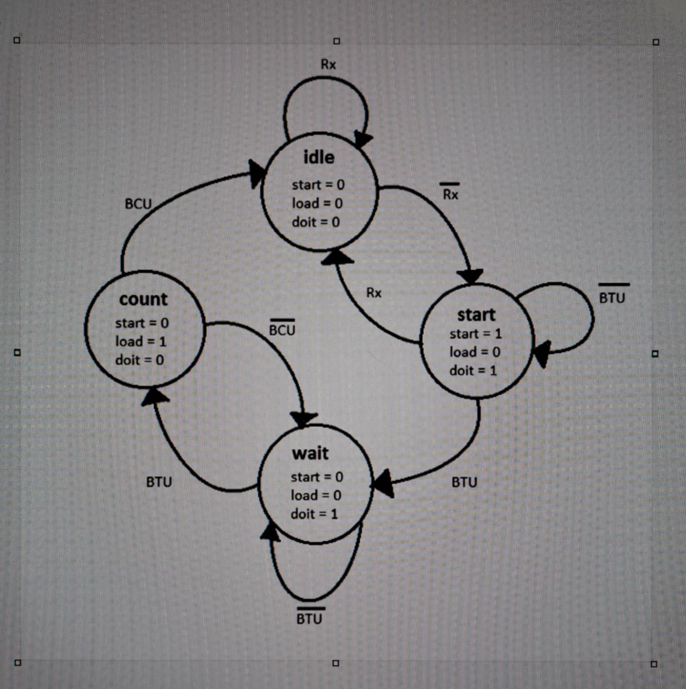

# Try out python, c, c++ code with FSM UART 

Simple Finite State Machine for UART control.

## Description

C++, Python, C programs that simulates a finite state machine (FSM) with 4 states to control UART communication.



## States

- **IDLE**: Waiting state (start=0, load=0, doit=0)
- **START**: Begin transmission (start=1, load=0, doit=1)  
- **COUNT**: Data counting (start=0, load=1, doit=0)
- **WAIT**: Buffer waiting (start=0, load=0, doit=1)

## Input/Output

**Inputs:**
- Rx, BTU, BCU
**Outputs:**
- start, load, doit: Control signals

## Usage

C++
```bash
g++ -o main.cpp main.out
./main.out
```

Python 
```
python main.py 
```

C 
```
gcc -o main.c main.out
./main.out
```

Program runs in debug mode - enter values for Rx, BTU, BCU to see FSM state transitions.

## Example

```
Rx: 0
BTU: 1  
BCU: 0
Current state: WAIT
```

## Features

- Interactive debug mode
- 8 automatic test cases
- Real-time state display
- Simple FSM logic, easy to understand

Perfect project for learning state machines and basic C++.

#### Run all 3 versions on Power Shell
.\test.bat
